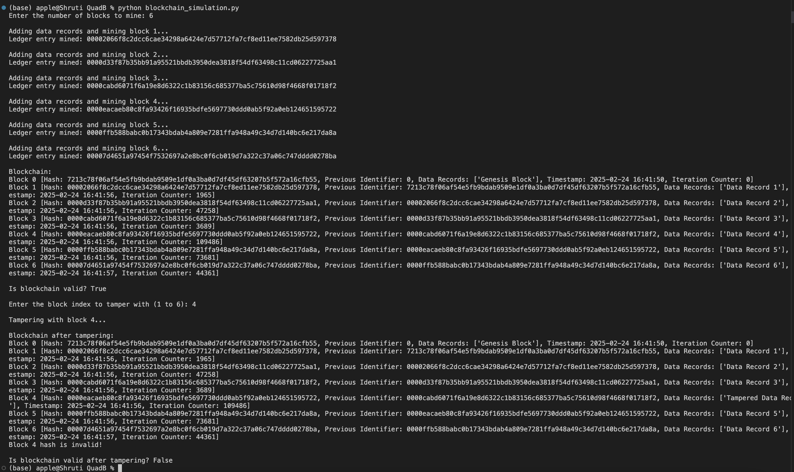

# Simple Blockchain Simulation Assignment

## Overview

This project simulates a basic blockchain with core features like block creation, proof-of-work, and chain validation. It demonstrates how a blockchain works by allowing users to add data records, mine blocks, and validate the integrity of the chain.

## Features

- **Block Structure**: Each block contains an entry ID, previous identifier, data records, timestamp, and iteration counter.
- **Proof-of-Work**: A basic proof-of-work mechanism is implemented to make block creation computationally intensive.
- **Chain Validation**: The blockchain's integrity is validated by checking hashes and previous identifiers.
- **Tamper Detection**: Users can tamper with the blockchain and verify how the validation mechanism detects changes.

## Technologies Used

- **Python**: The primary programming language used for this project.
- **Hashlib**: Used for generating SHA-256 hashes.
- **JSON**: Used for encoding block data into JSON strings.
- **Rich**: Used for text formatting and printing.
  
## Setup and Execution

1.  **Clone the repository:**

    ```
    git clone https://github.com/Shruti192903/Simple-Blockchain-Simulation-Assignment.git
    cd Simple-Blockchain-Simulation-Assignment
    ```

2.  **Install Dependencies:**

    Ensure you have Python installed. If you need to install additional packages, run:

    ```
    pip install -r requirements.txt
    ```

3.  **Run the Blockchain Script:**

    ```
    python blockchain_simulation.py
    ```

4. **Usage**:
  - **Enter Blocks to Mine:** Specify the number of blocks.
  - **View Blockchain:** See block details.
  - **Validate Chain:** Check if the blockchain is valid.
  - **Tamper & Revalidate:** Alter a block and verify the chain's integrity again.

## Project Structure

- **blockchain_simulation.py**: Contains the core blockchain logic.
- **requirements.txt**: Lists dependencies required by the project.
- **README.md**: This file provides setup and execution instructions.
- **Dockerfile**: Used for creating a Docker image of the project.

## Docker Setup

**Build Docker Image:**
   ```
   docker build -t blockchain-simulation
   ```


## Output:


##


